<div align="center">

# COLMAP Video-to-3D Pipeline

**영상 하나로 컬러 포인트클라우드와 3D 메시를 만드는 CUDA 가속 파이프라인**

[](https://ubuntu.com/)
[](https://colmap.github.io/)
[](https://developer.nvidia.com/cuda-toolkit)
[](#license)

Video → Frames → SfM → Dense Point Cloud → Triangle Mesh

[빠른 시작](#빠른-시작) · [동작 원리](#파이프라인) · [실측 결과](#실측-결과) · [상세 가이드](COLMAP_USAGE_GUIDE.md)

</div>

---

## 프로젝트 소개

스마트폰이나 카메라로 촬영한 영상을 입력하면 FFmpeg와 COLMAP을 연결해 다음 결과를 자동으로 생성합니다.

- 일정 간격으로 추출한 이미지 프레임
- 카메라 위치와 sparse reconstruction
- 컬러와 normal을 포함한 dense point cloud
- Poisson surface reconstruction 기반 triangle mesh
- 프레임 흐림 및 중복 품질 보고서

Ubuntu 24.04와 NVIDIA GPU 환경을 기준으로 작성했으며, 각 단계를 개별 실행하거나 하나의 스크립트로 전체 파이프라인을 처리할 수 있습니다.

## 파이프라인

```mermaid
flowchart LR
    A[Video] -->|FFmpeg| B[Image Frames]
    B --> C[SIFT Features]
    C --> D[Feature Matching]
    D --> E[SfM / Camera Poses]
    E --> F[Sparse Point Cloud]
    F --> G[PatchMatch Stereo]
    G --> H[Depth Map Fusion]
    H --> I[Dense Point Cloud]
    I --> J[Poisson Meshing]
    J --> K[Triangle Mesh]
```



| 단계 | 핵심 도구 | 출력 |
|---|---|---|
| 프레임 추출 | FFmpeg | `frame_*.jpg` |
| 특징점 검출·매칭 | SIFT GPU | `database.db` |
| Sparse reconstruction | COLMAP SfM | 카메라 자세, sparse points |
| Depth 추정 | PatchMatch Stereo | depth/normal maps |
| Fusion | Stereo Fusion | `fused.ply` |
| 표면 생성 | Poisson Mesher | `mesh.ply` |

원리에 대한 자세한 설명은 [사용 가이드](COLMAP_USAGE_GUIDE.md#3d-모델이-만들어지는-원리)를 참고하세요.

## 빠른 시작

### 1. 저장소 받기

```bash
git clone https://github.com/yoonie03/colmap-video-to-3d.git
cd colmap-video-to-3d
```

### 2. 환경 확인

```bash
bash scripts/check_environment.sh
```

CUDA Toolkit 또는 COLMAP CUDA 빌드가 없다면 제공된 설치 스크립트를 사용할 수 있습니다.

```bash
bash scripts/install_cuda_toolkit.sh
bash scripts/install_colmap_cuda.sh
```

> 설치 스크립트는 시스템 패키지와 `/usr/local`을 변경할 수 있습니다. 실행 전에 내용을 검토하세요.

### 3. 영상에서 3D 모델 생성

```bash
bash scripts/run_video_to_3d.sh \
  --video /absolute/path/to/input.MOV \
  --project-name my_scan \
  --output-root /absolute/path/to/output \
  --fps 2 \
  --max-size 1280 \
  --quality medium \
  --keep-frames
```

완료 후 주요 결과는 다음 위치에 생성됩니다.

```text
output/
├── images/my_scan/                 # 추출 프레임
├── workspace/my_scan/
│   ├── database.db
│   ├── sparse/0/                   # 카메라 및 sparse model
│   └── dense/fused.ply             # dense point cloud
└── result/my_scan/
    ├── point_cloud.ply
    └── mesh.ply                    # 최종 triangle mesh
```

## 주요 옵션

| 옵션 | 설명 | 권장값 |
|---|---|---|
| `--fps` | 초당 추출할 프레임 수 | 일반 촬영 `2`, 빠른 이동 `3~5` |
| `--frame-step` | N프레임마다 한 장 추출 | `--fps` 대신 선택 사용 |
| `--max-size` | 이미지 긴 변의 최대 크기 | 속도 `1280`, 품질 `1920` |
| `--quality` | JPEG 품질 | `medium` 또는 `high` |
| `--sparse-only` | Sparse reconstruction까지만 실행 | 촬영 상태 사전 점검 |
| `--resume` | 완료된 단계를 건너뛰고 재개 | 중단 후 재실행 |
| `--keep-frames` | 추출한 프레임 보존 | 권장 |
| `--force` | 기존 workspace/result 삭제 후 재실행 | 주의해서 사용 |

전체 옵션과 예시는 [사용 가이드](COLMAP_USAGE_GUIDE.md#주요-옵션)에 정리되어 있습니다.

## 실측 결과

RTX 5070 Ti, 2fps, 최대 1280px 조건에서 측정한 결과입니다.

| 데이터셋 | 영상 | 프레임 등록 | Dense points | Mesh vertices | Mesh faces | 처리 시간 |
|---|---:|---:|---:|---:|---:|---:|
| `bench_1` | 43.3초 | 87/87 | 1,092,915 | 3,301,858 | 6,484,165 | 정상 재처리 25분 47초 |
| `bridge_1` | 38.4초 | 74/77 | 377,653 | 962,386 | 1,883,722 | End-to-end 19분 5초 |

> 저장소에는 개인정보와 용량을 고려해 원본 영상, 추출 프레임, 데이터베이스, 포인트클라우드와 메시를 포함하지 않습니다.

측정 기준과 sparse 통계는 [결과 보고서](COLMAP_RESULTS.md)에서 확인할 수 있습니다.

## Blackwell GPU / PTX 호환성

RTX 50 시리즈 환경에서 아래 오류가 발생할 수 있습니다.

```text
the provided PTX was compiled with an unsupported toolchain
```

이 저장소에는 CUDA 13.3 forward-compat 라이브러리를 적용하는 `colmap_cuda13_3.sh` 래퍼가 포함되어 있습니다. 단, 라이브러리 바이너리 자체는 저장소에 포함하지 않습니다.

```bash
./colmap_cuda13_3.sh patch_match_stereo [options]
```

환경별 원인과 해결 기록:

- [PTX toolchain 오류 보고서](INSTALL_PTX_TOOLCHAIN_ERROR.md)
- [설치 및 디버깅 요약](INSTALL_DEBUG_SUMMARY.md)

## 프로젝트 구조

```text
.
├── scripts/
│   ├── check_environment.sh
│   ├── extract_video_frames.sh
│   ├── frame_quality_check.py
│   ├── install_colmap_cuda.sh
│   ├── install_cuda_toolkit.sh
│   └── run_video_to_3d.sh
├── colmap_cuda13_3.sh
├── render_fused_preview.py
├── COLMAP_RESULTS.md
├── COLMAP_USAGE_GUIDE.md
└── README.md
```

## 촬영 팁

- 대상 주변을 천천히 한 방향으로 이동하세요.
- 연속 프레임이 약 60~80% 겹치도록 촬영하세요.
- 갑작스러운 회전, 흔들림, 디지털 줌을 피하세요.
- 유리, 거울, 물, 움직이는 사람이나 식물은 재구성을 방해할 수 있습니다.
- 단색 표면은 특징점이 부족하므로 주변 질감이나 임시 마커를 활용하세요.
- 먼저 `--sparse-only`로 카메라 등록률을 확인하면 긴 dense 작업의 실패를 줄일 수 있습니다.

## 문서

- [전체 사용 가이드](COLMAP_USAGE_GUIDE.md)
- [실측 결과 보고서](COLMAP_RESULTS.md)
- [CUDA/PTX 오류 분석](INSTALL_PTX_TOOLCHAIN_ERROR.md)
- [설치 디버깅 기록](INSTALL_DEBUG_SUMMARY.md)

## 요구 환경

- Ubuntu 24.04
- NVIDIA GPU 및 호환 드라이버
- CUDA Toolkit
- COLMAP with CUDA
- FFmpeg / FFprobe
- CMake / Ninja / GCC
- Python 3

정확한 설치 상태는 다음 명령으로 검사할 수 있습니다.

```bash
bash scripts/check_environment.sh
```

## License

현재 별도 라이선스가 지정되어 있지 않습니다. 재사용이나 배포가 필요한 경우 저장소 소유자에게 문의하세요.
